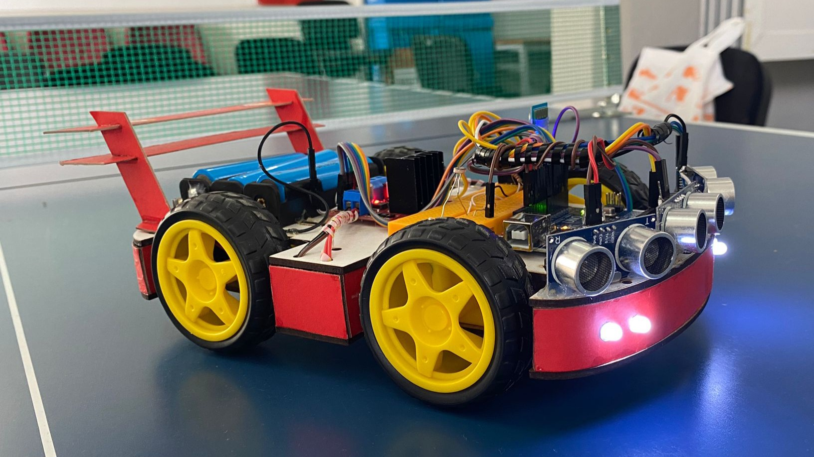
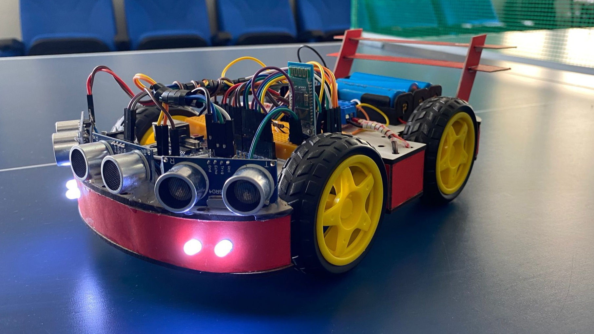
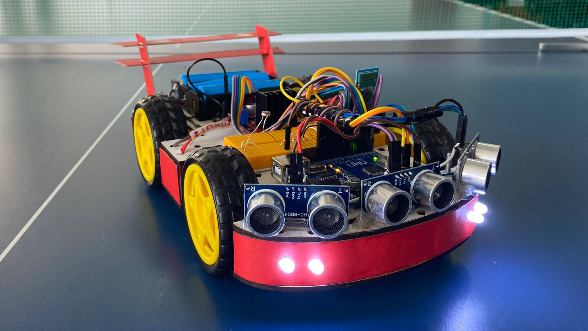
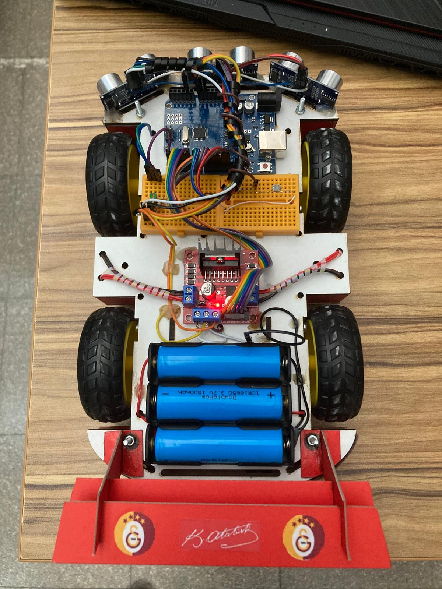
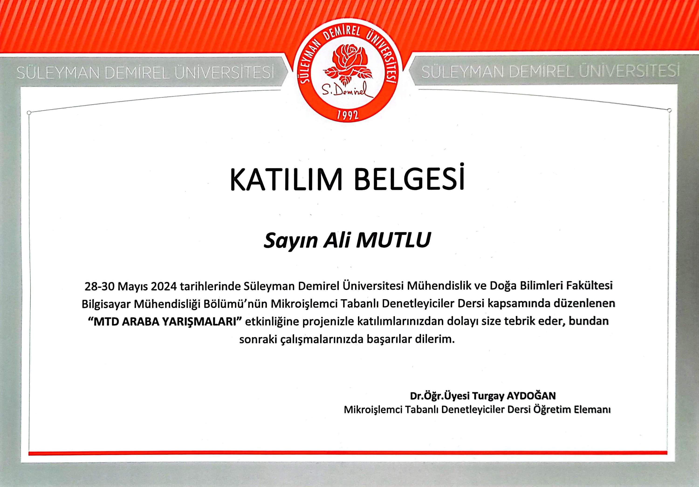

# Arduino ile Araç Tasarımı

Süleyman Demirel Üniversitesi Bilgisayar Mühendisliği Lisans Programı'nın Mikroişlemci Tabanlı Denetleyiciler dersi kapsamında, Arduino ile tasarladığım 4WD araç projesidir. İki model olarak tasarlanan bu araç;   
- İlk model [otonom olarak engellerden kaçan bir araç](./engelden-kacan-otonom-arac/README.md) 
- İkinci model ise [Bluetooth ile uzaktan kontrollü bir araç](./bt-uzaktan-kumandalı-arac/README.md),  
olarak kullanılabilmesi için kodlanmıştır.

### Malzeme Listesi
- Arduino Uno
- L298N Motor Sürücüsü
- HC05 Bluetooth Modülü
- HC-SR04 Ultrasonik Mesafe Sensörü x 3
- LDR (Foto Direnç)
- Direnç
- Led Diyot
- Erkek-Dişi Jumper
- Erkek-Erkek Jumper
- 18650 Pil x 3
- 18650 Pil Yuvası x 3
- Mini Board x 2
- 4WD Araç Şasesi
- DC Motor ve Teker x 4

    

## Araç Fotoğrafları

    

## Katılım Belgesi
Bu derste bizlere her zaman destek olan Dr. Öğr. Üyesi Turgay AYDOĞAN hocamıza teşekkür ederim.

